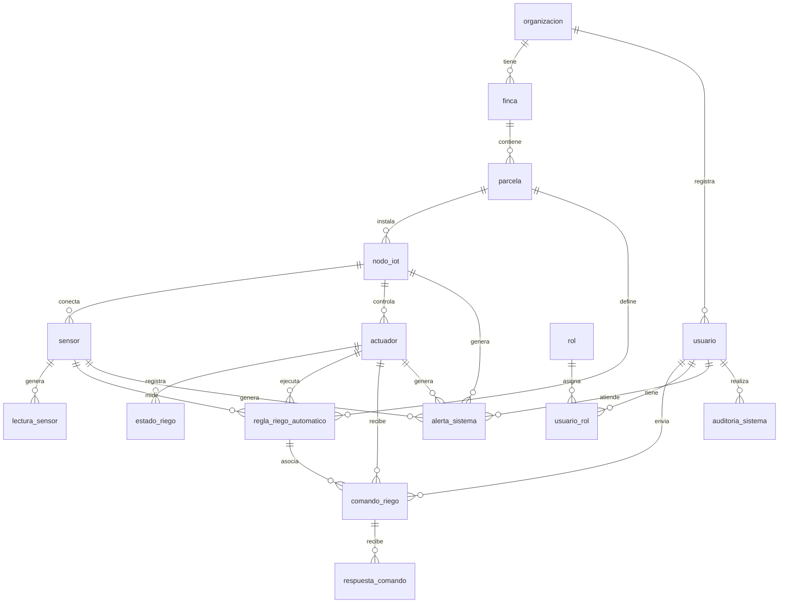

# Diseno de base de datos - Sistema de riego inteligente

Este diseno corresponde a un sistema web completo para automatizacion de riego con ESP32, sensor DHT11, modulo rele, sensores, actuadores, usuarios, roles, alertas y auditoria.

El riego funciona de dos formas:

- Automatico: el ESP32 decide encender el rele cuando la humedad baja del 15% y apagar la bomba cuando llega al 80%.
- Manual desde web: un usuario puede activar o desactivar el riego desde la pagina web. Esta accion queda registrada como un comando manual para que el ESP32 la ejecute.

## Organizacion en Django

El proyecto queda organizado por aplicaciones segun la responsabilidad de cada modulo:

| Aplicacion Django | Tablas principales |
|---|---|
| usuarios | usuario, rol, usuario_rol |
| ubicaciones | organizacion, finca, parcela |
| iot | nodo_iot, sensor, lectura_sensor, actuador |
| riego | estado_riego, regla_riego_automatico, comando_riego, respuesta_comando |
| sistema | alerta_sistema, auditoria_sistema |

## 1. organizacion

Representa la entidad propietaria del sistema, por ejemplo una institucion, empresa agricola o grupo de usuarios.

| Campo | Tipo sugerido | Descripcion |
|---|---|---|
| id_organizacion | PK, entero | Identificador unico |
| nombre | varchar(150) | Nombre de la organizacion |
| nit_documento | varchar(50), opcional | Documento o identificacion legal |
| telefono | varchar(30), opcional | Telefono de contacto |
| email | varchar(120), opcional | Correo de contacto |
| direccion | varchar(200), opcional | Direccion principal |
| fecha_creacion | datetime | Fecha de registro |
| estado | varchar(20) | Activa, inactiva |

Relaciones:
- Una organizacion tiene muchas fincas.
- Una organizacion tiene muchos usuarios.

## 2. finca

Representa una finca asociada a una organizacion.

| Campo | Tipo sugerido | Descripcion |
|---|---|---|
| id_finca | PK, entero | Identificador unico |
| id_organizacion | FK | Relacion con organizacion |
| nombre | varchar(150) | Nombre de la finca |
| ubicacion | varchar(200) | Ubicacion textual |
| latitud | decimal(10,7), opcional | Coordenada geografica |
| longitud | decimal(10,7), opcional | Coordenada geografica |
| area_total | decimal(10,2), opcional | Area total de la finca |
| unidad_area | varchar(20) | m2, hectareas, fanegadas |
| fecha_creacion | datetime | Fecha de registro |
| estado | varchar(20) | Activa, inactiva |

Relaciones:
- Una finca pertenece a una organizacion.
- Una finca tiene muchas parcelas.

## 3. parcela

Representa una zona especifica de cultivo dentro de una finca.

| Campo | Tipo sugerido | Descripcion |
|---|---|---|
| id_parcela | PK, entero | Identificador unico |
| id_finca | FK | Relacion con finca |
| nombre | varchar(150) | Nombre de la parcela |
| tipo_cultivo | varchar(100) | Cultivo sembrado |
| area | decimal(10,2) | Area de la parcela |
| unidad_area | varchar(20) | m2, hectareas, etc. |
| tipo_suelo | varchar(100), opcional | Arcilloso, arenoso, franco, etc. |
| descripcion | text, opcional | Observaciones |
| estado | varchar(20) | Activa, inactiva |

Relaciones:
- Una parcela pertenece a una finca.
- Una parcela puede tener varios nodos IoT.
- Una parcela puede tener programaciones de riego.

## 4. nodo_iot

Representa el dispositivo fisico principal, por ejemplo un ESP32 instalado en una parcela.

| Campo | Tipo sugerido | Descripcion |
|---|---|---|
| id_nodo | PK, entero | Identificador unico |
| id_parcela | FK | Relacion con parcela |
| codigo_nodo | varchar(80), unico | Codigo o serial del ESP32 |
| nombre | varchar(100) | Nombre del nodo |
| descripcion | text, opcional | Informacion adicional |
| ubicacion | varchar(150), opcional | Ubicacion dentro de la parcela |
| direccion_ip | varchar(45), opcional | IP del dispositivo |
| mac_address | varchar(30), opcional | MAC del ESP32 |
| fecha_instalacion | date | Fecha de instalacion |
| ultima_conexion | datetime, opcional | Ultima conexion recibida |
| estado | varchar(30) | Activo, inactivo, mantenimiento, desconectado |

Relaciones:
- Un nodo IoT pertenece a una parcela.
- Un nodo IoT puede tener muchos sensores.
- Un nodo IoT puede tener muchos actuadores.

## 5. sensor

Representa cada sensor conectado a un nodo IoT. Para el DHT11 se pueden registrar sensores logicos como temperatura y humedad.

| Campo | Tipo sugerido | Descripcion |
|---|---|---|
| id_sensor | PK, entero | Identificador unico |
| id_nodo | FK | Relacion con nodo_iot |
| nombre | varchar(100) | Nombre del sensor |
| tipo_sensor | varchar(50) | Temperatura, humedad_ambiente, humedad_suelo, lluvia, etc. |
| modelo | varchar(50) | DHT11, DHT22, capacitivo, etc. |
| unidad_medida | varchar(20) | C, %, lux, mm, etc. |
| pin_conexion | varchar(20), opcional | Pin usado en el ESP32 |
| valor_minimo | decimal(10,2), opcional | Rango minimo esperado |
| valor_maximo | decimal(10,2), opcional | Rango maximo esperado |
| estado | varchar(20) | Activo, inactivo, danado |
| fecha_instalacion | date | Fecha de instalacion |

Relaciones:
- Un sensor pertenece a un nodo IoT.
- Un sensor genera muchas lecturas.

## 6. lectura_sensor

Registra las mediciones enviadas por los sensores.

| Campo | Tipo sugerido | Descripcion |
|---|---|---|
| id_lectura | PK, entero | Identificador unico |
| id_sensor | FK | Relacion con sensor |
| valor | decimal(10,2) | Valor medido |
| unidad_medida | varchar(20) | Unidad de la medicion |
| fecha_hora | datetime | Momento de la lectura |
| calidad_dato | varchar(30) | Valido, sospechoso, error |
| observacion | text, opcional | Comentarios sobre la lectura |

Relaciones:
- Una lectura pertenece a un sensor.
- Muchas lecturas pertenecen a un sensor.

## 7. actuador

Representa dispositivos que ejecutan acciones, como modulo rele, bomba o valvula.

| Campo | Tipo sugerido | Descripcion |
|---|---|---|
| id_actuador | PK, entero | Identificador unico |
| id_nodo | FK | Relacion con nodo_iot |
| nombre | varchar(100) | Nombre del actuador |
| tipo_actuador | varchar(50) | Rele, bomba, valvula, motor |
| modelo | varchar(80), opcional | Modelo del actuador |
| pin_conexion | varchar(20), opcional | Pin usado en el ESP32 |
| estado_actual | varchar(20) | Encendido, apagado, error |
| fecha_instalacion | date | Fecha de instalacion |
| estado | varchar(20) | Activo, inactivo, mantenimiento |

Relaciones:
- Un actuador pertenece a un nodo IoT.
- Un actuador puede tener muchos estados de riego.
- Un actuador recibe comandos de riego.

## 8. estado_riego

Guarda el historial del estado real del riego.

| Campo | Tipo sugerido | Descripcion |
|---|---|---|
| id_estado_riego | PK, entero | Identificador unico |
| id_actuador | FK | Relacion con actuador |
| estado | varchar(20) | Encendido, apagado |
| modo | varchar(20) | Automatico, manual, programado |
| fecha_hora_inicio | datetime | Inicio del estado |
| fecha_hora_fin | datetime, opcional | Fin del estado |
| duracion_segundos | entero, opcional | Duracion del riego |
| motivo | varchar(100), opcional | Humedad baja, comando manual, programacion |

Relaciones:
- Un estado de riego pertenece a un actuador.
- Un actuador tiene muchos registros de estado de riego.

## 9. regla_riego_automatico

Define la condicion que usa el ESP32 para activar o apagar el riego automaticamente. En este proyecto no se programa por hora: el ESP32 enciende el modulo rele cuando la humedad baja del 15% y apaga la bomba cuando llega al 80%.

| Campo | Tipo sugerido | Descripcion |
|---|---|---|
| id_regla | PK, entero | Identificador unico |
| id_parcela | FK | Relacion con parcela |
| id_actuador | FK | Actuador que ejecutara el riego |
| id_sensor_humedad | FK | Sensor de humedad usado como referencia |
| nombre | varchar(100) | Nombre de la regla |
| humedad_encendido | decimal(5,2) | Umbral para encender el riego. Valor recomendado: 15 |
| humedad_apagado | decimal(5,2) | Umbral para apagar el riego. Valor recomendado: 80 |
| activa | boolean | Indica si esta habilitada |
| descripcion | text, opcional | Observaciones de la regla |
| fecha_creacion | datetime | Fecha de creacion |

Relaciones:
- Una regla pertenece a una parcela.
- Una regla usa un sensor de humedad.
- Una regla controla un actuador.
- Una regla puede quedar asociada a comandos o eventos de riego.

## 10. comando_riego

Registra ordenes enviadas al sistema, por ejemplo encender o apagar el rele. Estas ordenes pueden venir de la pagina web por accion manual del usuario o del sistema automatico.

| Campo | Tipo sugerido | Descripcion |
|---|---|---|
| id_comando | PK, entero | Identificador unico |
| id_actuador | FK | Actuador que recibe el comando |
| id_usuario | FK, opcional | Usuario que envio el comando |
| id_regla | FK, opcional | Regla automatica asociada al comando |
| comando | varchar(30) | Encender, apagar, reiniciar |
| origen | varchar(30) | Manual, automatico, dispositivo, sistema |
| parametro | json/text, opcional | Datos extra del comando |
| fecha_hora_envio | datetime | Momento de envio |
| estado_comando | varchar(30) | Pendiente, enviado, ejecutado, fallido |

Relaciones:
- Un comando pertenece a un actuador.
- Un comando puede ser generado por un usuario.
- Un comando puede estar asociado a una regla automatica del ESP32.
- Un comando puede tener una o varias respuestas.

Endpoints sugeridos para la pagina web:

- `POST /api/comandos-riego/activar-manual/`
- `POST /api/comandos-riego/desactivar-manual/`

Body:

```json
{
  "actuador_id": 1
}
```

## 11. respuesta_comando

Guarda la respuesta del ESP32 o del sistema frente a un comando.

| Campo | Tipo sugerido | Descripcion |
|---|---|---|
| id_respuesta | PK, entero | Identificador unico |
| id_comando | FK | Relacion con comando_riego |
| respuesta | varchar(100) | OK, error, recibido, ejecutado |
| mensaje | text, opcional | Detalle de la respuesta |
| codigo_error | varchar(50), opcional | Codigo tecnico si falla |
| fecha_hora_respuesta | datetime | Momento de respuesta |

Relaciones:
- Una respuesta pertenece a un comando.
- Un comando puede tener varias respuestas.

## 12. usuario

Representa las personas que acceden al sistema web.

| Campo | Tipo sugerido | Descripcion |
|---|---|---|
| id_usuario | PK, entero | Identificador unico |
| id_organizacion | FK | Organizacion a la que pertenece |
| nombres | varchar(100) | Nombres del usuario |
| apellidos | varchar(100) | Apellidos del usuario |
| email | varchar(120), unico | Correo de acceso |
| password_hash | varchar(255) | Contrasena cifrada |
| telefono | varchar(30), opcional | Telefono |
| estado | varchar(20) | Activo, inactivo, bloqueado |
| ultimo_acceso | datetime, opcional | Ultimo inicio de sesion |
| fecha_creacion | datetime | Fecha de registro |

Relaciones:
- Un usuario pertenece a una organizacion.
- Un usuario puede tener muchos roles mediante usuario_rol.
- Un usuario puede enviar comandos de riego.
- Un usuario puede generar registros de auditoria.

Nota para Django: si usan `django.contrib.auth.models.User`, esta tabla puede extenderse con un perfil de usuario en lugar de crear la autenticacion desde cero.

## 13. rol

Define permisos generales dentro del sistema.

| Campo | Tipo sugerido | Descripcion |
|---|---|---|
| id_rol | PK, entero | Identificador unico |
| nombre | varchar(80) | Administrador, operario, supervisor, invitado |
| descripcion | text, opcional | Descripcion del rol |
| estado | varchar(20) | Activo, inactivo |

Relaciones:
- Un rol puede pertenecer a muchos usuarios mediante usuario_rol.

## 14. usuario_rol

Tabla intermedia para la relacion muchos a muchos entre usuario y rol.

| Campo | Tipo sugerido | Descripcion |
|---|---|---|
| id_usuario_rol | PK, entero | Identificador unico |
| id_usuario | FK | Relacion con usuario |
| id_rol | FK | Relacion con rol |
| fecha_asignacion | datetime | Fecha en que se asigno el rol |
| asignado_por | FK usuario, opcional | Usuario que asigno el rol |
| estado | varchar(20) | Activo, inactivo |

Relaciones:
- Un usuario puede tener muchos roles.
- Un rol puede estar asignado a muchos usuarios.

## 15. alerta_sistema

Registra alertas generadas por lecturas, nodos, sensores, actuadores o reglas del sistema.

| Campo | Tipo sugerido | Descripcion |
|---|---|---|
| id_alerta | PK, entero | Identificador unico |
| id_nodo | FK, opcional | Nodo relacionado |
| id_sensor | FK, opcional | Sensor relacionado |
| id_actuador | FK, opcional | Actuador relacionado |
| tipo_alerta | varchar(80) | Humedad baja, temperatura alta, nodo desconectado, falla rele |
| severidad | varchar(20) | Baja, media, alta, critica |
| mensaje | text | Descripcion de la alerta |
| fecha_hora | datetime | Momento de generacion |
| estado | varchar(30) | Abierta, atendida, cerrada |
| atendida_por | FK usuario, opcional | Usuario que atendio la alerta |
| fecha_atencion | datetime, opcional | Momento de atencion |

Relaciones:
- Una alerta puede estar asociada a un nodo, sensor o actuador.
- Una alerta puede ser atendida por un usuario.

## 16. auditoria_sistema

Guarda acciones importantes realizadas en el sistema.

| Campo | Tipo sugerido | Descripcion |
|---|---|---|
| id_auditoria | PK, entero | Identificador unico |
| id_usuario | FK, opcional | Usuario que realizo la accion |
| tabla_afectada | varchar(80) | Tabla modificada |
| id_registro_afectado | entero, opcional | Registro afectado |
| accion | varchar(30) | Crear, actualizar, eliminar, iniciar_sesion, enviar_comando |
| descripcion | text | Detalle de la accion |
| valor_anterior | json/text, opcional | Datos antes del cambio |
| valor_nuevo | json/text, opcional | Datos despues del cambio |
| direccion_ip | varchar(45), opcional | IP desde donde se hizo la accion |
| fecha_hora | datetime | Momento de la accion |

Relaciones:
- Un registro de auditoria puede estar asociado a un usuario.
- Un usuario puede tener muchos registros de auditoria.

## Resumen de relaciones principales

| Relacion | Cardinalidad |
|---|---|
| organizacion -> finca | 1 a muchos |
| organizacion -> usuario | 1 a muchos |
| finca -> parcela | 1 a muchos |
| parcela -> nodo_iot | 1 a muchos |
| nodo_iot -> sensor | 1 a muchos |
| sensor -> lectura_sensor | 1 a muchos |
| nodo_iot -> actuador | 1 a muchos |
| actuador -> estado_riego | 1 a muchos |
| parcela -> regla_riego_automatico | 1 a muchos |
| sensor -> regla_riego_automatico | 1 a muchos |
| actuador -> regla_riego_automatico | 1 a muchos |
| actuador -> comando_riego | 1 a muchos |
| usuario -> comando_riego | 1 a muchos |
| regla_riego_automatico -> comando_riego | 1 a muchos |
| comando_riego -> respuesta_comando | 1 a muchos |
| usuario -> usuario_rol | 1 a muchos |
| rol -> usuario_rol | 1 a muchos |
| usuario <-> rol | muchos a muchos mediante usuario_rol |
| nodo_iot/sensor/actuador -> alerta_sistema | 1 a muchos opcional |
| usuario -> auditoria_sistema | 1 a muchos |

## Diagrama ER en Mermaid


